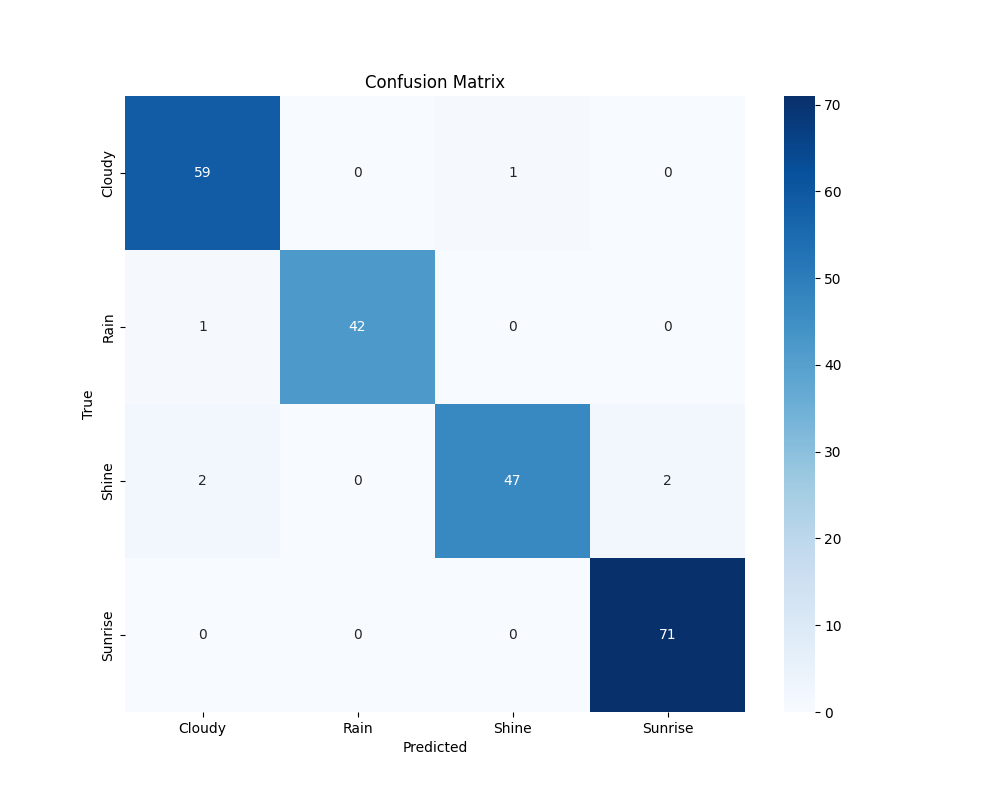
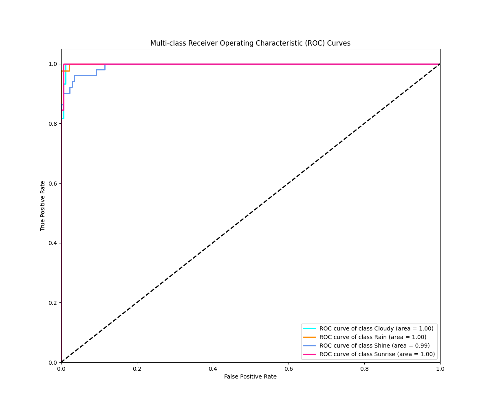
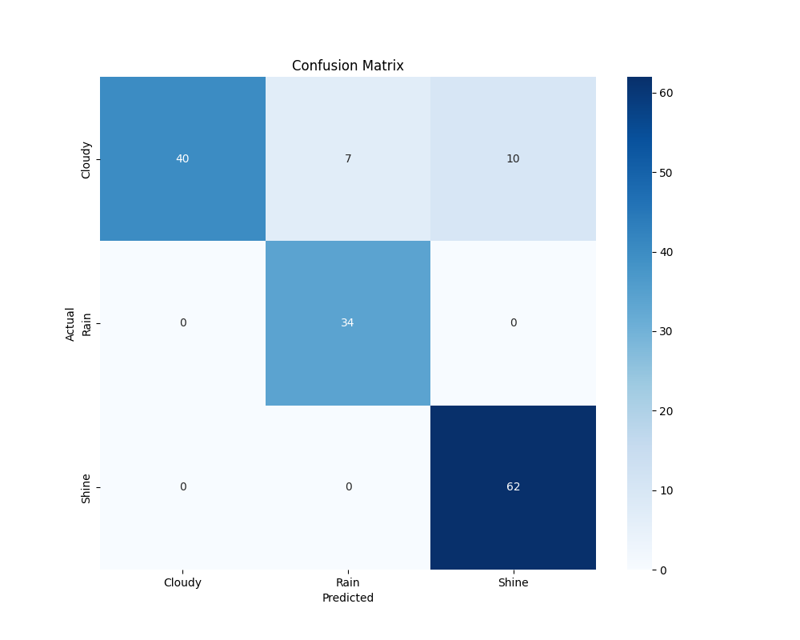
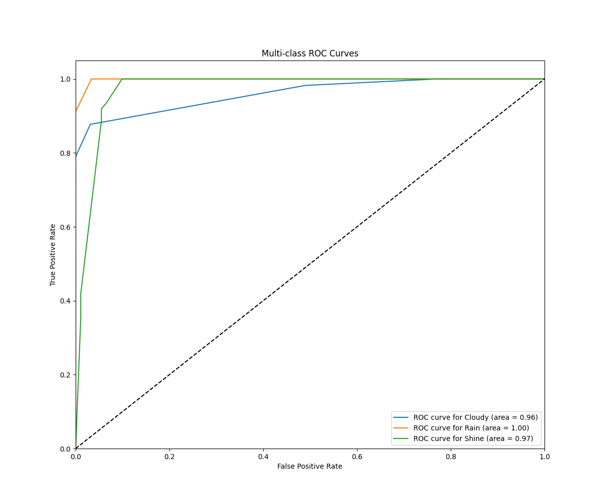

# WeatherVision: Multi-class Weather Classification

This repository contains a project for multi-class weather classification using two different approaches: a classic deep learning model and a large language model (LLM) with vision capabilities.

## Table of Contents

- [Features](#features)
- [Dataset](#dataset)
- [Installation](#installation)
- [Usage](#usage)
- [Model 1: ResNet-18 Transfer Learning](#model-1-resnet-18-transfer-learning)
- [Model 2: Gemma 3 Vision Model](#model-2-gemma-3-vision-model)
- [Results](#results)
- [Dependencies](#dependencies)

## Features

-   **Two Model Implementations:** Compare a classic computer vision model (ResNet-18) with a modern multi-modal vision model (Gemma 3).
-   **Data Preparation:** Scripts to download and prepare the dataset for training.
-   **Model Training & Evaluation:** Train the ResNet-18 model and evaluate both models to generate classification reports, confusion matrices, and ROC curves.
-   **Prediction:** Use either model to predict the weather category of new images.

## Dataset

The project uses the "Multi-class Weather Dataset for Image Classification" from Kaggle. The `download_data.py` script can be used to download the dataset using the Kaggle API.

The dataset should be placed in the `dataset` directory.

## Installation

1.  **Clone the repository:**
    ```bash
    git clone <repository-url>
    cd weathervision
    ```

2.  **Install dependencies:**
    Make sure you have Python 3 installed. You can install the required packages using pip:
    ```bash
    pip install -r requirements.txt
    pip install scikit-learn matplotlib seaborn tqdm
    ```

3.  **Ollama Setup (for Gemma 3 model):**
    To use the Gemma 3 model, you need to have Ollama installed. Follow the instructions on the [Ollama website](https://ollama.com/).

## Usage

This project provides two distinct models for weather classification. Below are the instructions for using each.

### Model 1: ResNet-18 Transfer Learning

This approach uses a pre-trained ResNet-18 model and fine-tunes it on the weather dataset.

1.  **Download the data:**
    ```bash
    python download_data.py
    ```

2.  **Prepare the data:**
    ```bash
    python prepare_data.py
    ```

3.  **Train the model:**
    ```bash
    python train.py
    ```

4.  **Evaluate the model:**
    ```bash
    python evaluate.py
    ```

5.  **Make predictions:**
    ```bash
    python predict.py --image <path/to/image>
    ```

### Model 2: Gemma 3 Vision Model

This approach uses the `gemma3:4b-it-qat` multi-modal model running locally with Ollama to perform zero-shot classification.

1.  **Classify a single image:**
    Make sure the Ollama service is running. The first time you run the script, it will automatically download the Gemma 3 model.
    ```bash
    python classify_ollama.py --image <path/to/your/image.jpg>
    ```

2.  **Evaluate the model:**
    This script will evaluate the Gemma 3 model on a sample of the dataset (or the full dataset if you configure it) and generate a classification report, confusion matrix, and ROC curves.
    ```bash
    python evaluate_vision_model.py
    ```

## Results

Below are the performance results for both models.

### Model 1: ResNet-18 Results

**Classification Report:**

| Class      | Precision | Recall | F1-Score | Support |
| :--------- | :-------- | :----- | :------- | :------ |
| Cloudy     | 0.95      | 0.98   | 0.97     | 60      |
| Rain       | 1.00      | 0.98   | 0.99     | 43      |
| Shine      | 0.98      | 0.92   | 0.95     | 51      |
| Sunrise    | 0.97      | 1.00   | 0.99     | 71      |
| **---**    | **---**   | **---**| **---**  | **---** |
| Accuracy   |           |        | 0.97     | 225     |
| Macro Avg  | 0.98      | 0.97   | 0.97     | 225     |
| Weighted Avg| 0.97      | 0.97   | 0.97     | 225     |

**Confusion Matrix:**



**ROC Curves:**



### Model 2: Gemma 3 Results

**Classification Report:**

| Class      | Precision | Recall | F1-Score | Support |
| :--------- | :-------- | :----- | :------- | :------ |
| Cloudy     | 1.00      | 0.70   | 0.82     | 57      |
| Rain       | 0.83      | 1.00   | 0.91     | 34      |
| Shine      | 0.86      | 1.00   | 0.93     | 62      |
| **---**    | **---**   | **---**| **---**  | **---** |
| Accuracy   |           |        | 0.89     | 153     |
| Macro Avg  | 0.90      | 0.90   | 0.89     | 153     |
| Weighted Avg| 0.91      | 0.89   | 0.88     | 153     |

**Confusion Matrix:**



**ROC Curves:**



## Dependencies

The project relies on the following Python libraries:

-   `torch`
-   `torchvision`
-   `scikit-learn`
-   `kaggle`
-   `kagglehub`
-   `pandas`
-   `matplotlib`
-   `numpy`
-   `tqdm`
-   `requests`
-   `seaborn`

You can install all dependencies by running `pip install -r requirements.txt` and `pip install scikit-learn matplotlib seaborn tqdm`.